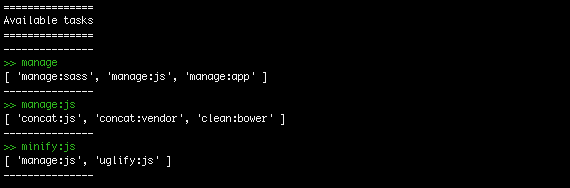

# et-grunt 0.1.1 [](http://badge.fury.io/js/et-grunt) [](https://travis-ci.org/JPeer264/et-grunt)
> Grunt task manager including [jit-grunt](https://www.npmjs.com/package/jit-grunt)

et-grunt is a task manager which makes your life easier. It also loads tasks when you really need them.

## Before
```js
grunt.loadNpmTasks('grunt-contrib-clean');
grunt.loadNpmTasks('grunt-contrib-connect');
grunt.loadNpmTasks('grunt-contrib-copy');
grunt.loadNpmTasks('grunt-contrib-concat');
...

grunt.registerTask('manage:js', [
	'clean:js',
	'concat:js',
]);

grunt.registerTask('manage:assets', [
	'concat:assets',
	'copy:assets',
]);

grunt.registerTask('serve:dev', [
	'clean',
	'manage:js',
	'connect'
]);
```
## After
```js
require('et-grunt')(grunt, {
	manage: {
		js: [
			'clean:js',
			'concat:js'
		],
		assets: [
			'concat:assets',
			'copy:assets'
		]
	},
	serve: {
		dev: [
			'clean',
			'manage:js',
			'connect'
		]
	}
});
```

## Install

`npm install et-grunt --save-dev`

## Usage

```js
require('et-grunt')(grunt, tasksAsObject);
```

```js
// optional
var jitMappings = {
	yourStaticJitMappings
};

require('et-grunt')(grunt, {
	// task
	manage: {
		// default task, means just 'manage'
		default: [
			'manage:sass',
			'manage:js',
			'manage:app',
		],
		// sub task -> 'manage:js'
		js: [
			'concat:js',
			'concat:vendor',
			'clean:bower'
		],
	},
	minify: {
		js: [
			'manage:js',
			'uglify:js'
		]
	}
}, jitMappings);
```

**Now available in your shell:**
```shell
grunt manage
grunt manage:js
grunt minify:js
```

#### Gruntdefault task

The very first object value should have the value `default`

```js
default: ['taskName']
``` 

#### Default (taskName)

In every object you can write `default` as key and `et-grunt` knows automatically that the following array should be called as default.
**Example:**
```js
taskName: {
	default: ['concat']
}
```
Available as:
```shell
grunt taskName
```


#### Subtasks (taskName:subtask)

If you want to have subtasks like `manage:js` then you have to nest an object into the other object. **Example:**
```js
taskName: {
	subtask: ['concat:js']
}
```

Available as:
```shell
grunt taskName:subtask
```

---

### Use jit-grunt

> **Note:** How jit-grunt works can you read [here](https://github.com/shootaroo/jit-grunt)

#### Use static mappings

The argument after the tasks are reserved for jit static mappings.

```js
var jitMappings = {
	// all settings
};

require('et-grunt')(grunt, tasksAsObject, jitMappings);
```

#### Use options

`require('et-grunt')(grunt, tasksAsObject)(options);`

Example **pluginsRoot**:
```js
require('jit-grunt')(grunt, tasksAsObject)({
  	pluginsRoot: 'other/dir'
});
```
---

### Pre-Registered tasks

#### tasks

**Default** 

> see which tasks are available

Run `grunt tasks` and you will see all available tasks


**Extended**

> + see which options every task will need

Run `grunt tasks:ext` or `grunt tasks:extended`



## Release History

- 2015-09-30   v0.1.1	Small fixes
- 2015-09-30   v0.1.0   Added jit-grunt options support + pre-registered task.
- 2015-09-25   v0.0.2   Added jit-grunt static maps support.
- 2015-09-25   v0.0.1   First release.

## License

The MIT License (MIT)

Copyright (c) Jan Peer <janpeer264@gmail.com> (jpeer.at)

Permission is hereby granted, free of charge, to any person obtaining a copy
of this software and associated documentation files (the "Software"), to deal
in the Software without restriction, including without limitation the rights
to use, copy, modify, merge, publish, distribute, sublicense, and/or sell
copies of the Software, and to permit persons to whom the Software is
furnished to do so, subject to the following conditions:

The above copyright notice and this permission notice shall be included in
all copies or substantial portions of the Software.

THE SOFTWARE IS PROVIDED "AS IS", WITHOUT WARRANTY OF ANY KIND, EXPRESS OR
IMPLIED, INCLUDING BUT NOT LIMITED TO THE WARRANTIES OF MERCHANTABILITY,
FITNESS FOR A PARTICULAR PURPOSE AND NONINFRINGEMENT. IN NO EVENT SHALL THE
AUTHORS OR COPYRIGHT HOLDERS BE LIABLE FOR ANY CLAIM, DAMAGES OR OTHER
LIABILITY, WHETHER IN AN ACTION OF CONTRACT, TORT OR OTHERWISE, ARISING FROM,
OUT OF OR IN CONNECTION WITH THE SOFTWARE OR THE USE OR OTHER DEALINGS IN
THE SOFTWARE.
